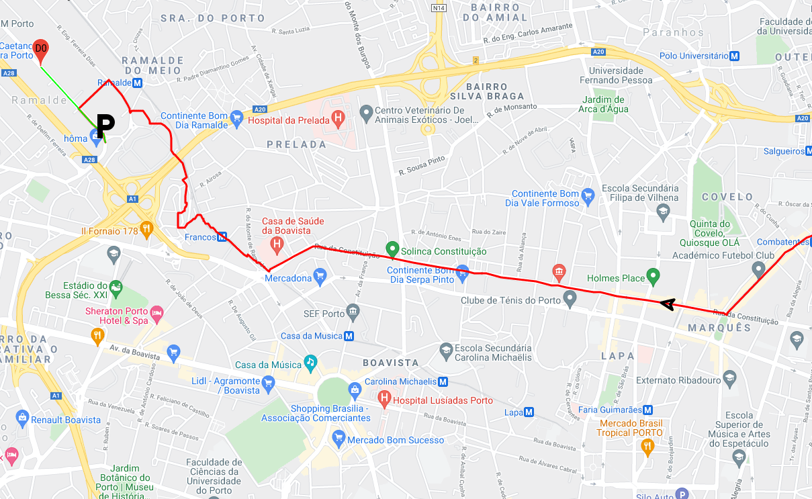

# Algorithm Analysis and Design project

## Project description

This project aims to help users choosing the best route given a list of points of interest. 
This also helps the user to find the best parking spot according to several parameters, like price, walking distance and the capacity of the park.

### Report related to this project

[Report](docs/report.pdf)

## Compiling

### Dependencies

#### Google Test

[Google Test](https://github.com/google/googletest)

### Requirements

* **CMake 3.17** or higher
* **C++ 17** or higher
* **Python** to run the http local server (can be used other services like [Node http-server](https://www.npmjs.com/package/http-server) or [VSCode Live Server](https://marketplace.visualstudio.com/items?itemName=ritwickdey.LiveServer))

### Linux

To compile in a linux distribution run ```build.sh```. The output files will be placed under the **build** folder.

### Windows

To compile in a windows environment, run ```winbuild.bat``` . The output files will be placed under the **winbuild** folder.

## Running

### Running in Linux

First run ```./server.sh``` and in another terminal run ```./run.sh```.

### Running in Windows

First run ```.\server.bat``` and in another terminal run ```.\run.bat```.

### Running in Clion

Make sure to choose working directory to be the root folder, so that the program writes data to the folder view/resources. You can open a http server under this view folder and open the browser to view the result.


### Google Maps API

In order to run the viewer, you need and internet connection to acquire a [Google API Key](https://developers.google.com/maps/documentation/javascript/get-api-key) and replace `YOURAPIKEY` with it it under [index.html](view/index.html#L14)

## Screenshots and Gifs




### License

[MIT](https://opensource.org/licenses/MIT)
